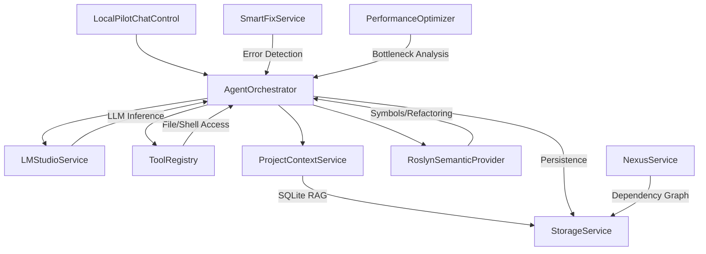

# LocalPilot Project Knowledge Graph

LocalPilot is a privacy-first, agent-driven AI pair programmer for Visual Studio. It uses local LLMs through LM Studio's OpenAI-compatible API and deep IDE integration.

## 🏗️ System Architecture

LocalPilot follows an **Agentic OODA Loop** (Observe, Orient, Decide, Act) architecture, powered by a high-performance SQLite storage engine.

---

## 🧩 Core Services Map

| Service | Responsibility | Key Features |
| :--- | :--- | :--- |
| **StorageService** | **The Persistence Engine**. | **SQLite WAL Mode**, FTS5 Search, Busy-Timeout (5s), Self-Healing Initialization. |
| **AgentOrchestrator** | The "Brain". Manages the autonomous loop. | **Performance Shield**, Context Budgeting (2k limit), OODA Orientation. |
| **GlobalPriorityGuard** | Resource Coordinator. | **Yield-on-Action**, 30s Smart Cooldown, CancellationToken-based abortion. |
| **LMStudioService** | OpenAI-compatible local LLM interface. | Request timeout, circuit breaker, streaming tool calls, text-only fallback. |
| **ProjectContextService**| RAG Layer. Semantic code search. | **Differential SQLite Sync**, Roslyn Chunking, **2MB File Cap**. |
| **NexusService** | Full-Stack Bridge. Maps dependencies. | **Persistent Graph Storage**, Cross-Stack Trace (C# to TS/TSX). |
| **RoslynSemanticProvider**| Semantic Intelligence. | Neighborhood Context, Project-wide Rename, Semantic Diagnostics. |
| **ToolRegistry** | Capability Layer. | File I/O (Safe Overwrite), Grep, Terminal, Unit Testing. |
| **SmartFixService** | Self-Heal Watchdog. | Real-time "Fix with AI" proposals for compilation errors. |
| **PerformanceOptimizer** | Proactive Optimization. | Detects O(n²) loops, blocking async, redundant allocations. |

---

## 🛠️ Agent Capability Suite (Tools)

The agent has access to several native tools via the `ToolRegistry`:

*   **FileSystem**: `read_file`, `write_file`, `list_directory`, `delete_file`.
*   **Search**: `grep_search` (High-perf parallel scan), `SearchContextAsync` (Hybrid BM25 + Vector Search).
*   **Editing**: `replace_text` (Precise block replacement with CRLF/LF normalization).
*   **Development**: `run_terminal` (cmd.exe commands), `run_tests` (auto-detects toolchain).
*   **Nexus**: `trace_dependency` (Cross-stack path tracing), `analyze_impact` (Full-stack change impact analysis).
*   **Analysis**: `list_errors` (VS Error List access).

---

## 🎨 UI & Design Principles (Ghost UI)

The UI is built using **WPF** and adheres to the "Ghost UI" design mandate: minimalist, responsive, and natively theme-aware.

*   **ChatControl**: The primary container. Manages streaming narrative and activity logs.
*   **Full UI Virtualization**: The entire message container and activity log utilize `VirtualizingStackPanel` with recycling.
*   **Batched Token Pipeline**: Fragments are buffered and flushed at **30 FPS** via a `DispatcherTimer`.
*   **Incremental Markdown**: A structural additive parser (O(1) per frame) ensures smooth text flow during streaming.
*   **AgentTurnLayout**: Separates the **Narrative** (LLM text) from the **Activity** (Tool execution timeline).
*   **Human-in-the-Loop (HIL)**: A security layer requiring user approval for "risky" tools (e.g., file overwrite).
*   **Staged Review**: Custom diff view for multi-file changes before final acceptance.

---

## ⚡ Performance & Resource Management

1.  **VRAM Management**: Models are automatically unloaded from VRAM after 5-10 minutes of inactivity using `keep_alive` tuning.
2.  **Persistent Caching**: Embeddings and FTS5 indices are stored in SQLite, eliminating re-indexing stutters.
3.  **Busy-Timeout Protection**: SQLite utilizes a **5000ms busy timeout** to prevent deadlocks during high-concurrency renames.
4.  **Priority Guard**: All background services yield CPU/GPU resources immediately when an agent turn starts.
5.  **I/O Throttling**: RAG indexing is limited to **2 concurrent files** to preserve disk bandwidth.
6.  **Context Budgeting**: Tool outputs are capped at **2,000 characters** to preserve LLM reasoning quality.
7.  **Solution Visibility**: Project Map generation is capped at **1,000 files** to ensure O(1) snapshot time.
8.  **Layout Debouncing**: Scroll operations are throttled to **~25 FPS** to prevent layout thrashing.
9.  **Self-Healing**: The storage engine automatically resets if the database becomes corrupted.

---

## 📂 Project Metadata (Internal)

*   **App Data Directory**: `%AppData%\LocalPilot\`
*   **Persistent Database**: `localpilot_v2.db` (All files, vectors, and graph nodes)
*   **Rules**: `LOCALPILOT.md` (Project-specific instructions)
*   **Logs**: `%AppData%\LocalPilot\logs\`
